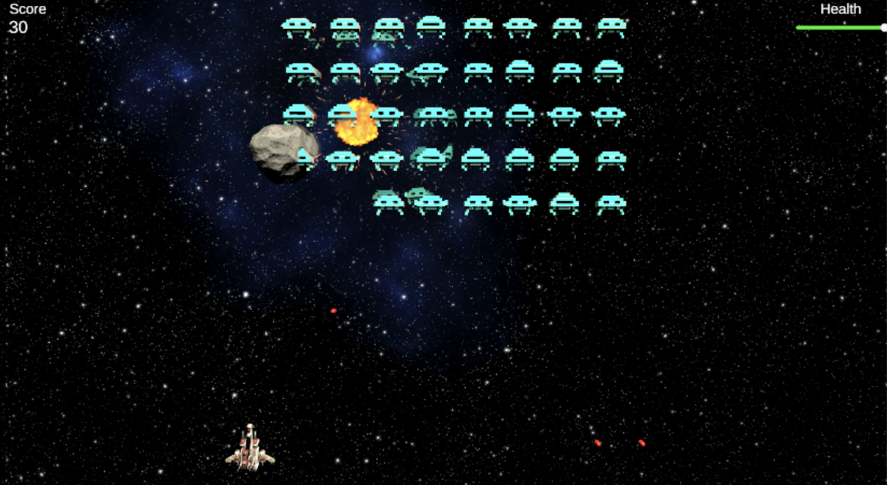

# SpaceInvaders3D

SpaceInvaders3D is a remake of the arcade game SpaceInvaders designed in Unity. 

# Running
Upon installing UnityHub, clone the repo and import the repo folder as a project in UnityHub. You can then directly play the game using the play button

